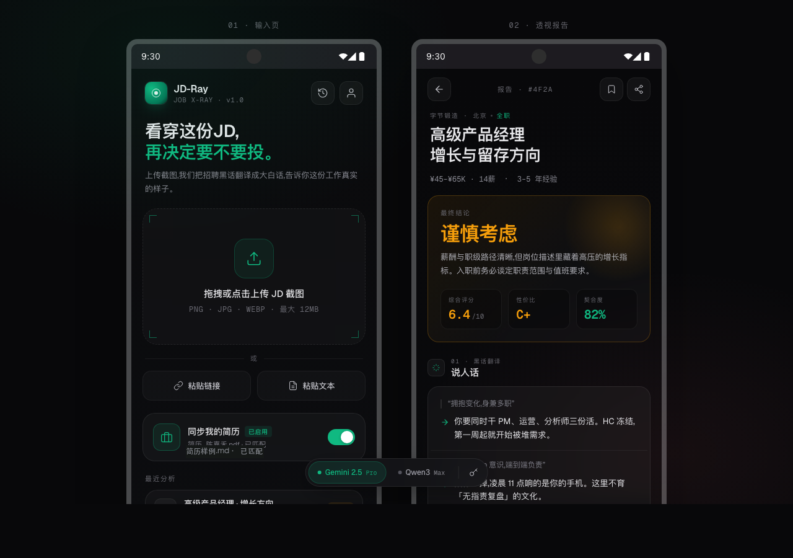

# JD-Ray Local / 岗位黑话解码

把招聘 JD 截图翻译成人话。  
上传岗位截图，可选同步 Markdown / TXT 简历，调用 Gemini 或 Qwen-VL 生成一份更犀利、更务实的“岗位真相”报告。

[](https://github.com/jay122312803-boophello/jd-image-analyzer/releases/tag/v1.0.1)
[](./LICENSE)
[](#隐私边界)

## 下载体验

- Android APK：请到 [GitHub Releases](https://github.com/jay122312803-boophello/jd-image-analyzer/releases) 下载最新版。
- 当前版本：`jd-ray-local-v1.0.1-android.apk`
- SHA256：

```text
0847212c053783ae6ec913175182c883d6ae54eceae93bf243ab0eb523d638c8
```

> 这个 APK 暂未上架应用市场。Android 安装时出现“未知来源应用”提示属于正常现象，请只从本仓库 Release 页面下载。

## 应用预览



> 预览图使用演示岗位与演示简历信息，仅用于展示界面风格。

## 核心能力

- **JD 截图分析**：支持上传、拖拽、粘贴岗位截图。
- **黑话翻译**：把“全生命周期负责”“跨部门推进”“Agent 系统”翻译成真实工作内容。
- **风险判断**：输出红旗、亮点、薪资逻辑、典型一天和最终投递建议。
- **简历匹配**：可选同步 `.md` / `.txt` 简历，只参与本次分析。
- **双模型支持**：支持 Gemini 2.5 Flash 与 Qwen3 VL Plus。
- **本地优先**：无业务后端，Key 和历史报告只保存在本机。

## 适合谁

- 想快速判断一个 AI / 技术岗位是不是“标题很香，落地很苦”的求职者。
- 想把 JD 拆成真实职责、背锅风险、成长空间和投递策略的人。
- 想自托管、自填 API Key、不把简历交给第三方简历平台的人。

## 隐私边界

JD-Ray Local 没有自建业务后端，也没有账号系统。

- API Key 只保存在当前设备的 `localStorage`。
- 历史记录只保存结构化报告，不保存原始岗位截图。
- 简历全文不进入历史记录。
- 调用模型时，岗位截图和可选简历文本会发送给你当前选择的模型服务商。
- 卸载 Android App 后，WebView 内的本地历史和 Key 通常会随应用数据一起删除。

## 模型配置

首次使用需要在底部模型 Dock 的钥匙按钮中配置 API Key。

- Gemini：填写 Google Gemini API Key。
- Qwen：填写阿里云 DashScope API Key，并选择对应区域 endpoint。

中国区体验建议优先使用 Qwen / DashScope；Gemini 可作为自备网络环境下的可选模型。

## 本地开发

```bash
npm install
npm run dev
```

默认开发地址：

```text
http://127.0.0.1:5177/
```

## 构建

Web 构建：

```bash
npm run build
```

Android Debug 包：

```bash
npm run build
npm run cap:sync
cd android
./gradlew assembleDebug
```

Android Release 包：

```bash
npm run build
npm run cap:sync
cd android
./gradlew assembleRelease
```

Release 包需要自行准备签名文件。示例：

```properties
storeFile=your-release-key.jks
storePassword=your_store_password
keyAlias=your_key_alias
keyPassword=your_key_password
```

签名文件、APK、构建产物均已被 `.gitignore` 排除。后续升级同一个 Android 应用时，请继续使用同一份 keystore。

## 技术栈

React + Vite + Capacitor Android + Gemini API + DashScope Qwen-VL + jsQR

## 合规提示

本项目适合个人学习、内测和自用场景。若在中国区公开大规模分发，请自行评估 APP 备案、隐私政策、模型服务合规和应用市场审核要求。

## License

[MIT](./LICENSE)
